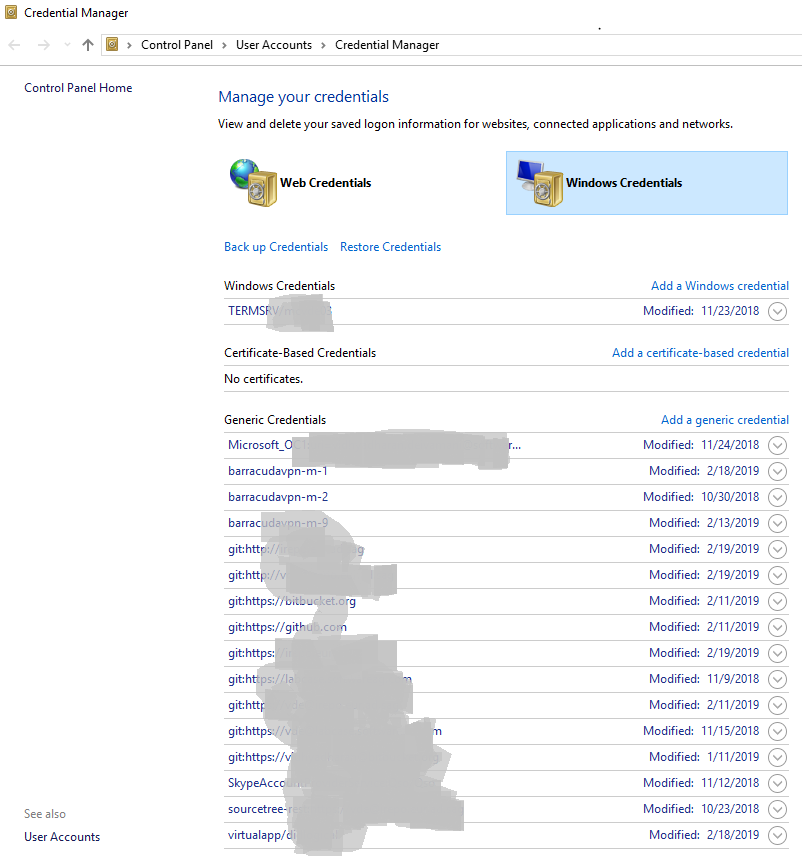

# My useful git commands

Useful git commands

## Table of contents

- [How to see my last commit](#how-to-see-my-last-commit)
- [How to output git log with the first line only?](#how-to-output-git-log-with-the-first-line-only)
- [How can i view a git log of just one user](#how-can-i-view-a-git-log-of-just-one-user)
- [How do I force git pull to overwire local files](#how-do-i-force-git-pull-to-overwire-local-files)
- [How do I determine the url of git repository](#how-do-i-determine-the-url-of-git-repository)
- [How do I go to specific revision](#how-do-i-go-to-specific-revision)
- [How do I tag a specific commit](#how-do-i-tag-a-specific-commit)
- [How do I delete a specific branch](#how-do-i-delete-a-specific-branch)
- [How to change author in a commit](#how-to-change-author-in-a-commit)
- [How to rename the git branch](#how-to-rename-the-git-branch)
- [How do I branch a specific commit](#how-do-i-branch-a-specific-commit)
- [How to reset the git password in windows](#how-to-reset-the-git-password-in-windows)
- [How to reset a git branch](#how-to-reset-a-git-branch)
- [How to reset a local commit](#how-to-reset-a-git-branch)
- [How to resolve merge conflicts](#how-to-resolve-merge-conflicts)

## How to see my last commit

This command is useful to see 'my last commit'

```md
git log --name-status HEAD^..HEAD
```

## How to output git log with the first line only

This command is useful to print commit history by one line

```md
git log --pretty=oneline --abbrev-commit
```

## How can i view a git log of just one user

This command is useful to see log by particular user

```md
git log --author="vidhya"
```

will match a commit made by "Vidhyadharan Deivamani" and also

```md
git log --author=deiva
```

[credits](https://stackoverflow.com/questions/4259996/how-can-i-view-a-git-log-of-just-one-users-commits?answertab=active#tab-top)

## How do I force git pull to overwire local files

This command is useful when you got git < branch > | MERGING issues

```md
git fetch --all
git reset --hard origin/master
```

or

```md
git reset --hard origin/<branch_name>
```

Note: the above command will overwrite your local files

[credits](https://stackoverflow.com/questions/1125968/how-do-i-force-git-pull-to-overwrite-local-files#8888015)

## How do I determine the url of git repository

Get only the remote url

```md
git config --get remote.origin.url
```

or

Get the entire url

```md
 git remote show origin
```

[credits](https://stackoverflow.com/questions/4089430/how-can-i-determine-the-url-that-a-local-git-repository-was-originally-cloned-fr?answertab=active#tab-top)

## How do I go to specific revision

Move to a specific commit or checkout to previous revision

First note the sha or revision number

```md
git log --pretty=oneline --abbrev-commit
```

Then

Check out the specific commit

```md
 git checkout <sha1 or revision>
```

[credits](https://stackoverflow.com/questions/7539130/go-to-particular-revision?answertab=active#tab-top)

## How do I tag a specific commit

Tag a specific commit

First note the sha or revision number

```md
git log --pretty=oneline
```

Then

Tag with revision number

```md
 git tag -a v1.2 444554738120233382c5912ebbca32592ba765ad -m "Message here"
```

*Warning:* This creates tags with the current date

To add a tag with specific date, add GIT_COMMITTER_DATE  environment variable with this YYYY-MM-DD HH:MM format.

```md
 GIT_COMMITTER_DATE="2006-10-02 10:31" git tag -a v1.2 444554738120233382c5912ebbca32592ba765ad -m "Message here"
```

To push a single tag:

```md
git push origin <tag_name>
```

And the following command should push all tags (not recommended):

```md
git push --tags
```

[credits](https://stackoverflow.com/questions/4404172/how-to-tag-an-older-commit-in-git?answertab=active#tab-top)

## How do i delete a specific branch

To delete the git remote branch

```md
git push --delete origin <branch_name>
```

To delete the local branch

```md
git branch -D <branch_name>
```

## How to change author in a commit

Sometime working in opensource and closed source, you might commit closed source with your personal email id.

```md
git commit --amend --author="vidhyadharan deivamani <it.vidhyadharan@gmail.com>" -m "commit description"
```

## How to rename the git branch

To rename git local and remote branch

- Rename your local branch and push to remote

```md
git branch -m old_branch_name  new_branch_name
git push --set-upstream origin new_branch_name
```

- Delete the old remote branch and push new branch name

```md
git push origin :old_branch_name  new_branch_name
```

## How do I branch a specific commit

You can create the branch via a hash:

```md
git branch branchname <sha1-of-commit>
```

To checkout the branch when creating it, use

```md
git checkout -b branchname <sha1-of-commit or HEAD~3>
```

## How to reset the git password in windows

In windows 10 you can find Windows Credentials at :

#### Control Panel\User Accounts\Credential Manager

#### Control Panel\All Control Panel Items\Credential Manager --> Windows Credentials

for your git server and then you can update password by clicking edit button.

 

## How to reset a git branch 
### How to reset a local commit 

 Remove all the  local commit and reset to the original remote branch

```md
git reset --hard origin/master
```

## How to resolve merge conflicts

One of the challenging task is resolving merge conflicts on Pull Request. Below command help you to merge with theirs strategy

### Merge on theirs

Step 1:

```md
git checkout branch_A
git pull origin branch_B -X theirs
```

Step 2: After the merge conflicts are resolved, stage the changes accordingly, commit the changes and push.

```md
git commit
git push origin HEAD
```

Step 3: The pull request will be updated and marked as merged.